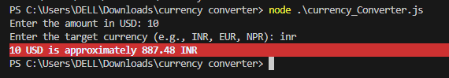

# 💱 Currency Converter

A simple **Node.js command-line Currency Converter** that converts **USD** to any target currency using real-time exchange rates from the **ExchangeRate API**.

---

## 🧩 Installation & Setup

1.  **Clone the Repository:**
    ```bash
    git clone [https://github.com/yourusername/currency-converter.git](https://github.com/yourusername/currency-converter.git)
    cd currency-converter
    ```

2.  **Install Dependencies:**
    ```bash
    npm install chalk
    ```

3.  **API Key Configuration:**
    * Get your free **API key** from [https://www.exchangerate-api.com](https://www.exchangerate-api.com).
    * Replace the placeholder in your code (e.g., `currency_converter.js`):
        ```javascript
        const apiKey = "YOUR_API_KEY_HERE";
        ```

4.  **Run the Converter:**
    ```bash
    node currency_converter.js
    ```

---

## 💡 Example Usage

The converter will prompt you for input in the terminal:

Enter the amount in USD: 10
Enter the target currency (e.g., INR, EUR, NPR): inr
10 USD is approximately 887.48 INR

I see you've provided a complete README file content for a Node.js currency converter.

I will present the information using **Markdown formatting** as requested, including the code block for the Node.js usage example and a separate code block for the author's GitHub link.

````markdown
# 💱 Currency Converter

A simple **Node.js command-line Currency Converter** that converts **USD** to any target currency using real-time exchange rates from the **ExchangeRate API**.

---

## 🧩 Installation & Setup

1.  **Clone the Repository:**
    ```bash
    git clone [https://github.com/yourusername/currency-converter.git](https://github.com/yourusername/currency-converter.git)
    cd currency-converter
    ```

2.  **Install Dependencies:**
    ```bash
    npm install chalk
    ```

3.  **API Key Configuration:**
    * Get your free **API key** from [https://www.exchangerate-api.com](https://www.exchangerate-api.com).
    * Replace the placeholder in your code (e.g., `currency_converter.js`):
        ```javascript
        const apiKey = "YOUR_API_KEY_HERE";
        ```

4.  **Run the Converter:**
    ```bash
    node currency_converter.js
    ```

---

## 💡 Example Usage

The converter will prompt you for input in the terminal:

````

Enter the amount in USD: 10
Enter the target currency (e.g., INR, EUR, NPR): inr
10 USD is approximately 887.48 INR

````

---

## ⚠️ Notes

* Ensure you have a **valid API key**; otherwise, you'll receive an HTML or error response.
* Works with **Node.js 18+**.

---

## 📸 Output Screenshot

Make sure your screenshot file (`output.png`) is saved in the same folder as your `README.md` file. GitHub will automatically display it.



---

## 👩‍💻 Author

* **Name:** Mahnoor Muhammad Naeem
* **Email:** `mahnoormuhammadnaeem99@gmail.com`
* **GitHub:**
    ```markdown
    [https://github.com/Mahnoor-Muhammad-Naeem](https://github.com/Mahnoor-Muhammad-Naeem)
    ```

````
