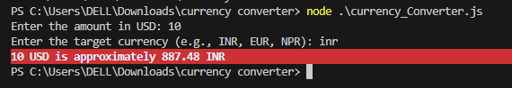

# 💱 Currency Converter (Node.js)


A simple **Node.js CLI app** that converts USD to other currencies (like INR, EUR, NPR, etc.) in real time using the [ExchangeRate API](https://www.exchangerate-api.com/).

---

## 🖼️ Project Screenshot



---

## 🚀 Features

- 🌐 Fetches **real-time exchange rates**
- 💵 Converts **USD to multiple currencies**
- 🧾 Simple and **interactive CLI**
- ⚡ **Fast, lightweight**, and easy to use
- 🛡️ Includes **error handling** for invalid input and API issues

---

## 🧰 Tech Stack

- **Node.js**
- **Chalk** (for colorful CLI output)
- **Readline** (for user input)
- **ExchangeRate API** (for live currency data)
- **HTTPS module** (for API requests)

---

## 📦 Installation

1. **Clone the repository**
   ```bash
   git clone https://github.com/your-username/currency-converter.git
   cd currency-converter
   ```

2. **Install dependencies**
   ```bash
   npm install chalk
   ```

3. **Get your free API key**  
   Sign up at [https://www.exchangerate-api.com](https://www.exchangerate-api.com)

4. **Add your API key**  
   Open `currency_Converter.js` and replace:
   ```javascript
   const apiKey = "YOUR_API_KEY";
   ```

---

## ▶️ How to Run

Run the project using Node.js:

```bash
node currency_Converter.js
```

### 🧩 Example Output

```
Enter the amount in USD: 10
Enter the target currency (e.g., INR, EUR, NPR): inr
10 USD is approximately 887.48 INR
```

---

## ⚠️ Notes

- Make sure **Node.js** is installed on your system.  
- If you see this error:
  ```
  ❌ Received HTML instead of JSON!
  ```
  → Your API key might be invalid or expired.  
- Always enter valid currency codes (e.g., `INR`, `EUR`, `PKR`, `NPR`).

---

## 🧠 Project Structure

```
currency-converter/
│
├── currency_Converter.js   # Main application file
├── output.png              # Screenshot for README
└── README.md               # Documentation file
```

---

## 📄 License

This project is licensed under the **MIT License**.  
Feel free to use and modify it for your learning or projects.

---

## 👩‍💻 Author

Made with ❤️ by **Mahnoor Muhammad Naeem**  
📧 Contact: mahnoormuhammadnaeem99@gmail.com  
🌐 GitHub: [@Mahnoor-Muhammad-Naeem](https://github.com/Mahnoor-Muhammad-Naeem)
